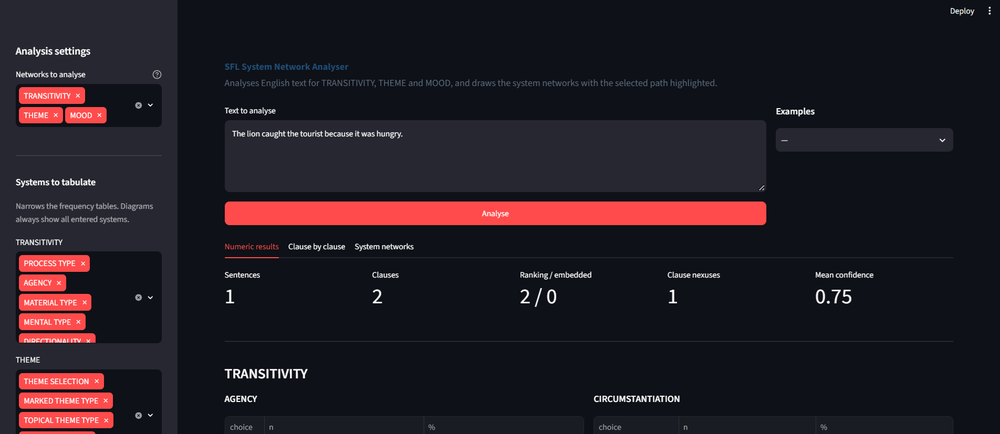

# SFL System Network Builder

Analyses English sentences using Systemic Functional Linguistics and draws the resulting system networks.

Give it a sentence; it finds the clauses, works out how they relate, analyses each one for TRANSITIVITY, THEME and MOOD, and renders a diagram with the selected path highlighted and every choice explained.



Reference grammar: Halliday & Matthiessen (2014), *Introduction to Functional Grammar*, 4th edition.

---

## Try it

```bash
pip install -r requirements.txt
python -m spacy download en_core_web_sm
python -m src.draw "The lion caught the tourist because it was hungry."
```

Writes one SVG per clause to `output/`. Add `--all` for all three networks, `--png` for PNG output.

From Python:

```python
from src.draw import draw, draw_all

draw("Mary saw the bird.")
draw_all("On Saturday they left.")
```

Or get the analysis as data:

```python
from src.analyser import analyse_text

result = analyse_text("She said that he had left.")
```

---

## What it does

**Finds the clauses.** Splits a sentence on the dependency parse and works out which clauses are *ranking* (part of a clause complex) and which are *embedded* (constituents of a group). That distinction matters: `The man [[who left early]] was tired` has an embedded relative clause, while `John, || who left early, || was tired` has a hypotactic one. Only ranking clauses take part in clause complexes.

**Relates them.** Builds a nexus for each link between ranking clauses, classifying taxis (parataxis or hypotaxis) and logico-semantic type (elaborating, extending, enhancing, locution, idea), and renders the IFG notation — `α ×β`, `1 "2`.

**Analyses each clause:**

| | What it works out |
|---|---|
| **MOOD** | declarative, polar / WH-interrogative, imperative (jussive, oblative, suggestive) |
| **THEME** | the Theme/Rheme boundary, textual and interpersonal elements, topical type, markedness, predication |
| **TRANSITIVITY** | process type, subtypes, participant roles, circumstances, agency |

**Explains itself.** Every choice carries a confidence and a written reason: *"'saw' is a mental process"*, *"Subject as Theme — unmarked for declarative"*, *"projected by 'said'"*. Where the evidence is weak the confidence drops rather than the tool guessing silently.

**Checks its own work.** Every analysis is validated against the network definition before it's returned. An analysis that skips a system it entered is caught, not shipped.

---

## Example

```
Mary saw the bird.

  Theme:   Mary  ||  Rheme: saw the bird
  Process: saw (mental, perceptive, like-type)
  Senser:      Mary
  Phenomenon:  the bird
  Agency:      effective
```

The diagram shows PROCESS TYPE and AGENCY braced together as simultaneous systems, `mental` selected with `material`, `relational` and the rest greyed beside it, and the line running right into MENTAL TYPE where `perceptive` is chosen.

---

## Design

**The grammar is data, not code.** The four networks live in `networks/*.json` as systems, terms, entry conditions and realization statements. The engine reads them; it doesn't hardcode them. Adding delicacy is a JSON edit, and the diagrams update automatically.

**The engine knows nothing about text.** `src/model.py`, `conditions.py`, `traversal.py` and `validator.py` operate purely on feature sets — nothing there imports spaCy. The analysers sit on top and ask the engine whether their answers are well-formed. When something goes wrong you know immediately whether it's a parsing problem or a grammar-encoding problem.

**Anything derivable is derived.** Simultaneity comes from systems sharing an entry condition, not from a flag. Multiple Theme is computed from the presence of textual or interpersonal elements, not selected — the alternative would be circular, since you only know a Theme is multiple *because* you found those elements.

**Rank is first-class.** TRANSITIVITY and THEME are clause-rank; TAXIS and LOGICO-SEMANTIC TYPE are clause-*nexus* rank, describing a relation rather than a property; circumstance type is element-rank, because one clause can carry several circumstances at once. "Yesterday she ran quickly" has both Location and Manner, which a flat feature set cannot express — so selection expressions are two-level.

---

## Validation

A selection expression is checked against five rules:

1. **Unknown feature** — not defined in this network
2. **Rank mismatch** — a clause-rank feature in a nexus expression
3. **Entry unsatisfied** — `transformative` without `material`
4. **Mutual exclusivity** — both `attributive` and `identifying`
5. **Incomplete** — a system was entered but nothing chosen from it

Rule 5 is what makes this a *system* network rather than a set of labels: entering a system obliges a choice. `{material}` alone is invalid, because AGENCY and CIRCUMSTANTIATION were entered and ignored.

Failures name the rule, the system and the features involved.

---

## Structure

| Path | Contents |
|---|---|
| `networks/*.json` | The four network definitions |
| `src/model.py` | Network, System, Term, Condition, SelectionExpression, Clause, Nexus |
| `src/loader.py` | JSON to model objects |
| `src/conditions.py` | Entry-condition evaluation |
| `src/traversal.py` | Entered systems, available choices, delicacy, simultaneity |
| `src/validator.py` | The five rules |
| `src/notation.py` | IFG clause-complex notation (α, ×β, "2) |
| `src/segmenter.py` | Clause segmentation, ranking vs embedded, nexuses |
| `src/theme.py` | MOOD and THEME analysis |
| `src/transitivity.py` | TRANSITIVITY analysis |
| `src/verb_lexicon.py` | Verb lists driving process-type classification |
| `src/analyser.py` | Ties it together; JSON-ready output |
| `src/renderer.py` | System networks as SVG |
| `src/draw.py` | Sentence in, diagram out |

```bash
pytest
```

---

## Accuracy

Process type is the hard part, and it is semantic rather than syntactic: *"she saw him"* and *"she hit him"* are structurally identical but construe different processes. Classification therefore runs from a curated verb lexicon plus syntactic disambiguation rules, and a verb outside the lexicon is flagged with low confidence rather than guessed at.

Clause status is the other weak point. Defining and non-defining relatives differ only by commas, and writers are inconsistent, so those cases are marked low-confidence rather than asserted.

Evaluation against a hand-annotated gold standard is in progress; per-system figures will be reported here rather than a single aggregate, since one number would hide which part is weak.

---

## Limitations

- **No nesting in clause complexes.** Nexuses are a flat list, so `1 ^ (2 ^ 3)` and `(1 ^ 2) ^ 3` are not distinguished.
- **No grammatical metaphor.** Nominalization concealing a process is out of scope — it needs the buried process recovered, which is a research problem rather than a feature.
- **`xcomp` is treated as a verbal group complex**, so *"wanted to leave"* is one clause. IFG is genuinely divided on this; the position is deliberate and flagged at low confidence.
- **Circumstantiation covers the frequent four** — Extent, Location, Manner, Cause — not all nine types.
- **Delicacy stops well short of IFG4.** Two or three levels, not the limits of the grammar. Extending it is a JSON edit, by design.
- **English, with declaratives as the primary case.**

---

## Prior art

Mick O'Donnell's [UAM CorpusTool](http://www.corpustool.com/) supports SFL annotation, but as manual and semi-automatic desktop software. This project aims at automatic analysis with the reasoning made visible — closer to a teaching and exploration tool than an annotation environment.

## Licence

MIT